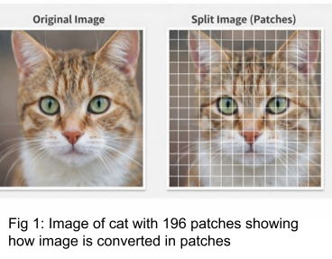
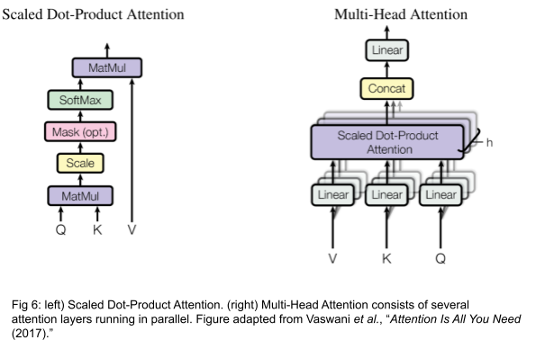
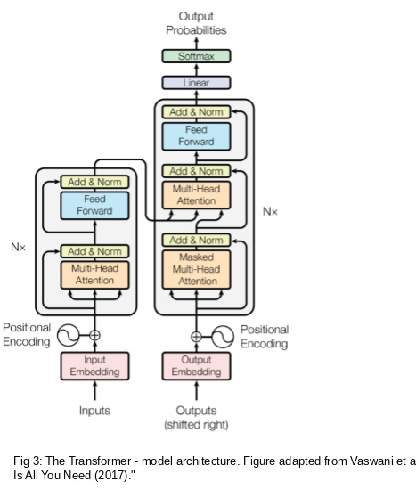

### Theory

Vision Transformers represent a paradigm shift in computer vision by replacing convolutional operations with attention-based learning mechanisms. Unlike Convolutional Neural Networks(CNN), which rely on local receptive fields, Vision Transformers model global relationships across the entire image using self-attention.

Stages in the VIT Training model:
* Stage1: Image patching
* Stage2 : Patch Embedding
* Stage3: Positional Encoding
* Stage4: Transformer Encoder Block
* Stage5: Classification token and MLP head

**I. Image patching**

Image patching refers to the process of partitioning an input image into a set of fixed-size, non-overlapping square patches, where each patch is subsequently flattened and embedded to form a token that serves as input to the transformer architecture.

Fig. 1. Is Illustration of image patching applied to an automobile image. The original input image is divided into 156 fixed-size, non-overlapping patches, demonstrating how the image is decomposed into smaller regions. Each patch represents a localized visual token that can be flattened and embedded before being processed by the transformer model. This figure serves as an example of the patch-based representation employed in Vision Transformer architectures.

**II. Patch Embedding**

In Vision Transformers, an image is first divided into fixed-size, non-overlapping patches. Each patch is flattened and linearly projected into an embedding space, forming a sequence of patch embeddings. Since transformers were originally designed for sequential data, positional embeddings are added to retain spatial information about the patches.

**III. Positional Encoding in Vision Transformers**

Since transformer architectures lack inherent awareness of token ordering and treat the input as an unordered set, explicit positional information must be provided. In vision-based transformers, spatial relationships are preserved by adding learnable positional embeddings to each patch token, along with the classification (CLS) token, thereby encoding the relative and absolute locations of image patches within the input sequence.

**Need for Positional Encoding:** Since transformer models process input tokens as an unordered set, positional encodings are incorporated to preserve spatial structure and encode patch location information within the image representation.

Common types of positional encoding used in ViT-model:

* **Learnable Positional Embeddings**: ViT uses learnable positional vectors to capture local and global spatial relationships adapting better than fixed encodings across image resolutions.

$$Z_0 = [x_{cls}; z_1; z_2; \ldots; z_N] + E_{pos}$$

* **Fixed (sinusoidal) absolute positional embeddings**
Same idea as the original Transformer sine/cosine encoding, but applied to the patch grid positions.
No extra learned parameters.

$$\text{pe}(\text{pos}, 2i) = \sin\left(\frac{\text{pos}}{10000^{2i/d_{\text{model}}}}\right)$$

$$\text{pe}(\text{pos}, 2i+1) = \cos\left(\frac{\text{pos}}{10000^{2i/d_{\text{model}}}}\right)$$

Where:
* pos = token position in the sequence (0, 1, 2, …)
* i = dimension index
* $d_{model}$ = model embedding size (e.g., 512)
* Even dimensions = sine
* Odd dimensions = cosine

This makes the embedding:
* Absolute (depends on exact position)
* Deterministic (no learning required)
* Continuous & smooth.

**IV. Self Attention Mechanism**

The core building block of a Vision Transformer is the self-attention mechanism, which enables each patch to attend to all other patches in the image. The self-attention mechanism enables the model to capture long-range dependencies and rich contextual relationships across the input, which are often difficult to model using convolutional operations alone. Multi-head self-attention further enhances this capability by allowing the model to focus on different aspects of the image simultaneously.

**Computation:**

$$\text{attention}(Q, K, V) = \text{softmax}\left(\frac{QK^T}{\sqrt{d_k}}\right)V, \quad Q = XW_Q, \quad K = XW_K, \quad V = XW_V$$

* Query (Q) = what this token is asking for
* Key (K) = what this token offers as information
* Value (V) = the actual content or meaning
* The attention score between tokens i and j is computed as:

$$\text{score}(i,j) = \frac{Q_i K_j^T}{\sqrt{d_k}}$$

These scores are normalised with a softmax to produce a attention weights:

$$\alpha_{ij} = \text{softmax}_j\left(\text{score}(i,j)\right)$$

Where: i, j = 0,1,2,3……
* $QK^T$ computes similarity between all pairs of tokens (dot product)
* $d_k = \frac{D}{h}$ the dimension per attention head
* Divide by $\sqrt{d_k}$ for scaling to prevent large values causing softmax saturation
* softmax normalizes scores into probabilities for attention weights
* Multiply by V to get weighted sum of information from all tokens

**V. Multi-Headed Self-Attention**

Instead of a single attention operation, Vision Transformers use Multi-Head Attention so the model can capture different relationships in parallel as shown in Fig 2.
A single attention head captures only one type of relationship—perhaps syntactic, positional, or semantic. To let the model learn multiple perspectives simultaneously, the Transformer employs multi head attention (MHA).

$$\text{multihead}(Q, K, V) = \text{concat}(\text{head}_1, \ldots, \text{head}_h) W_O$$

**Residual Connections and Layer Normalization**

Ensures stable training in deep networks by preserving information and normalizing activations.

* **Residual (Skip) Connections:** Residual connections bypass transformation blocks to preserve earlier layer information, preventing degradation in deep networks. They enable the model to learn incremental refinements, improving convergence and stability in deep ViTs.
* **Layer Normalization:** LayerNorm normalizes features across the input, stabilizing training and reducing internal covariate shift. Pre-LN ensures well-conditioned gradients and consistent scaling across tokens in deep Transformers.

**VI. Multi-headed-attention architecture:**

Refer to the right side of Fig .2 , where:
* The input tokens are first projected into three separate vectors—Query (Q), Key (K), and Value (V)—using learned linear transformations.
* These Q, K, and V representations are divided into h parallel attention heads, enabling the model to attend to information from multiple representation subspaces simultaneously.
* Within each head, scaled dot-product attention is computed as:

$$\text{attention}(Q, K, V) = \text{softmax}\left(\frac{QK^T}{\sqrt{d_k}}\right)V$$

where d denotes the dimensionality of the key vectors.

* This operation produces attention weights that quantify the relevance of each token with respect to all others, followed by a weighted aggregation of the value vectors.
* The outputs from all attention heads are concatenated and passed through a final linear projection layer to combine information from different heads.
* This mechanism enables the model to learn global contextual relationships and long-range dependencies, resulting in richer feature representations than those obtained using single-head attention or convolutional operations alone.

**VII. Classification Token**

A learnable classification (CLS) token is prepended to the sequence of patch embeddings to aggregate global contextual information across the input image. After propagation through the transformer encoder layers, the final CLS token representation is utilized for image-level classification. Owing to the large data requirements of Vision Transformers, pretrained models are typically adopted and subsequently fine-tuned on smaller datasets to achieve efficient learning and improved performance.

Vision Transformers typically require large datasets for effective training; therefore, pretrained models are often used and fine-tuned for smaller datasets such as CIFAR-10

**VIII. Model Architecture**

**Encoder and Decoder Stacks:**

**Encoder:** The encoder is composed of a stack of N = 6 as shown on the left side of Fig.3 identical layers. Each layer has two sub-layers. The first is a multi-head self-attention mechanism, and the second is a simple, position-wise fully connected feed-forward network. We employ a residual connection around each of the two sub-layers, followed by layer normalization . That is, the output of each sub-layer is LayerNorm(x + Sublayer(x)), where Sublayer(x) is the function implemented by the sub-layer itself. To facilitate these residual connections, all sub-layers in the model, as well as the embedding layers, produce outputs of dimension model = 512.

**Decoder:** The decoder is also composed of a stack of N = 6 as shown on the right side of Fig.3 identical layers. In addition to the two sub-layers in each encoder layer, the decoder inserts a third sub-layer, which performs multi-head attention over the output of the encoder stack. Similar to the encoder, we employ residual connections around each of the sub-layers, followed by layer normalization. We also modify the self-attention sub-layer in the decoder stack to prevent positions from attending to subsequent positions. This masking, combined with the fact that the output embeddings are offset by one position, ensures that the predictions for position i can depend only on the known outputs at positions less than i.

**IX. Transformer Encoder Block**

Residual connections stabilize training, while the MLP refines learned representations.

Let Z denote the input token embeddings to a transformer encoder block. The intermediate representation after multi-head self-attention and residual normalization is computed as

$$Z' = \text{layernorm}(Z + \text{msa}(Z))$$

Subsequently, the output of the encoder block is obtained by applying a position-wise multilayer perceptron followed by another residual connection and Layer Normalization:

$$Z_{\text{out}} = \text{layernorm}(Z' + \text{mlp}(Z'))$$

Above mentioned equations together describe the standard transformer encoder structure, where residual connections preserve input information and Layer Normalization stabilizes training, while the MSA and MLP modules respectively model global dependencies and enhance feature representations.

The transformer has two parts, the decoder which is on the left side in Fig 4. and the encoder which is on the right.
Imagine we are doing machine translation for now.
The encoder takes the input data (sentence), and produces an intermediate representation of the input.
The decoder decodes this intermediate representation step by step and generates the output.

**Working of Encoder:**
* Input (Embedded patches): Split the image into small patches and turn each patch into a vector (a token).
* Stack L times: The same encoder layer is repeated L times to improve features.

**One encoder layer:**
* Layer Normalization is applied before multi-head self-attention to stabilize feature distributions.
* Multi-head self-attention models global relationships among patch tokens.
* A residual connection adds the input back to preserve information and improve training stability.
* Layer Normalization followed by an MLP refines each token independently.
* A second residual connection produces enhanced token representations for downstream tasks.

**X. Summary of Core Components**

| Component | Purpose | Key Insight |
| :--- | :--- | :--- |
| **Input Embedding** | Converts tokens into numerical vectors. | Enables continuous-space representation. |
| **Positional Encoding** | Adds order information to embeddings. | Introduces sequence awareness. |
| **Self-Attention** | Captures relationships between all tokens. | Enables global contextual understanding. |
| **Multi-Head Attention** | Learn multiple relation types in parallel. | Improves diversity and expressiveness. |
| **Feed-Forward Network** | Applies nonlinear transformation per token. | Enhances representation depth. |
| **Residual + LN** | Stabilizes training and gradients. | Ensures smooth optimization and deep stacking. |

**XI. Use Cases of Vision Transformers:**

* **Access to large-scale labeled datasets and robust compute infrastructure -** vision transformers are data-hungry and require significant training time and memory, especially in their vanilla form. With enough data and compute, they are capable of outperforming CNNs in many benchmarks.

* **We need to capture long-range spatial relationships -** Unlike CNNs, which are local in their processing (remember the receptive field section), ViTs leverage self-attention to model relationships between all image patches, making them particularly useful for tasks where spatial context across the entire image matters.

* **To use pretrained models and transfer learning -** We can access pretrained ViTs (such as through Hugging Face or timm) and so fine-tuning becomes much more practical. In this case, even mid-sized datasets can give us great results without training from scratch.

**Merits of Vision Transformers:**
* Ability to model global context using self-attention
* Flexible architecture independent of image resolution
* Strong performance when pretrained on large datasets
* Interpretability through attention visualization

**Demerits of Vision Transformers:**
* High computational and memory requirements
* Large data dependency for training from scratch
* Slower convergence compared to CNNs on small datasets
