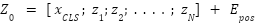
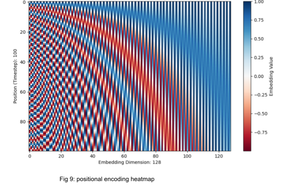
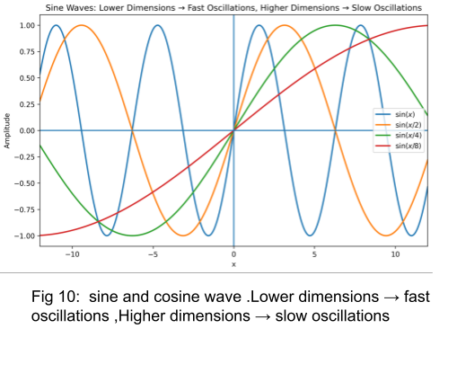
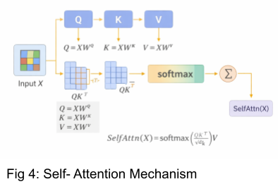
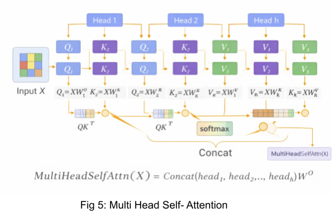
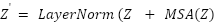
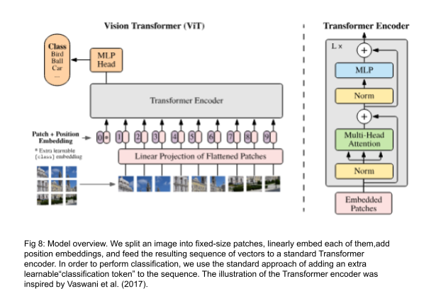

### Theory

Vision Transformers represent a paradigm shift in computer vision by replacing convolutional operations with attention-based learning mechanisms. Unlike Convolutional Neural Networks (CNN), which rely on local receptive fields, Vision Transformers model global relationships across the entire image using self-attention.

**Stages in the ViT Training model**

1. **Stage 1: Image patching**
2. **Stage 2: Patch Embedding**
3. **Stage 3: Positional Encoding**
4. **Stage 4: Transformer Encoder Block**
5. **Stage 5: Classification token and MLP head**

**I. Image Patching**

* **Image patching:** = cut an image into small equal squares (patches) and treat each patch like one "token" for the transformer.
* **Example:** 224×224 image with 16×16 patches → 14×14 = 196 patches.

**II. Patch Embedding**

In Vision Transformers, an image is first divided into fixed-size, non-overlapping patches. Each patch is flattened and linearly projected into an embedding space, forming a sequence of patch embeddings. Since transformers were originally designed for sequential data, positional embeddings are added to retain spatial information about the patches.

The above image is the sub part of patch embedding. It is clearly shown that the images are converted into small patches, which will then be converted into embedding and fed into the transformer block.

**III. Positional Encoding in Vision Transformers**

Transformers don't naturally know where a token comes from (they treat the input as a set). For images, position matters, so we add learnable positional embeddings to each patch token (and the CLS token) to encode spatial location.

**Need for Positional Encoding:** Since Transformers treat tokens as unordered, positional encodings are added to retain spatial structure and patch location information.

**Common types of positional encoding used in ViT-model:**
* **Learnable Positional Embeddings:** ViT uses learnable positional vectors to capture local and global spatial relationships adapting better than fixed encodings across image resolutions.

**Some more which are used in later ViT variants:**

* **Fixed (sinusoidal) absolute positional embeddings:** Same idea as the original Transformer sine/cosine encoding, but applied to the patch grid positions. No extra learned parameters.

**Equations:**
PE(pos, 2i) = sin(pos / 10000^(2i/d_model))
PE(pos, 2i+1) = cos(pos / 10000^(2i/d_model))

**Meaning of symbols:**
* **pos** → token position in the sequence (0, 1, 2, …)
* **i** → dimension index
* **d_model** → model embedding size (e.g., 512)
* Even dimensions → sine
* Odd dimensions → cosine

This makes the embedding:
* Absolute (depends on exact position)
* Deterministic (no learning required)
* Continuous & smooth

**Other types:**
* **2D positional embeddings (grid-aware absolute):** Encodes row and column separately (e.g., learn row embedding + learn column embedding, then combine), or uses a 2D table. Useful because images are naturally 2D.
* **Relative positional bias / relative positional embeddings:** Instead of storing "where each token is," it stores "how far apart two tokens are." Used heavily in ViT variants like Swin (relative position bias inside attention).
* **Rotary Position Embedding (RoPE) adapted to 2D:** Inject position by rotating query/key vectors; can be applied along x/y axes for images. Popular in newer transformer variants.
* **Interpolation / resizing of positional embeddings:** When input resolution changes (different number of patches), learned absolute embeddings are interpolated (usually bicubic) to fit the new grid.

**IV. Classification Token**

**Purpose of the CLS Token:** The CLS token is a learnable vector added to patch embeddings that gathers global information and is used for final classification, similar to BERT.

A special classification token (CLS token) is prepended to the sequence of patch embeddings. After passing through multiple transformer encoder layers, the final representation of this token is used for image classification. Vision Transformers typically require large datasets for effective training; therefore, pretrained models are often used and fine-tuned for smaller datasets such as CIFAR-10.

**V. Self Attention Mechanism**

The core building block of a Vision Transformer is the self-attention mechanism, which enables each patch to attend to all other patches in the image. This allows the model to capture long-range dependencies and contextual relationships that are difficult to model using convolution alone.

Multi-head self-attention further enhances this capability by allowing the model to focus on different aspects of the image simultaneously.

**Computation:**

Attention(Q, K, V) = softmax(QK^T / sqrt(d_k)) * V

* **Query (Q)** = what this token is asking for
* **Key (K)** = what this token offers as information
* **Value (V)** = the actual content or meaning

The attention score between tokens i and j is computed as:
Score(i,j) = Q_i . K_j

These scores are normalised with a softmax to produce attention weights.

* Q . K^T computes similarity between all pairs of tokens (dot product)
* d_k = the dimension per attention head
* Divide by sqrt(d_k) for scaling to prevent large values causing softmax saturation
* softmax normalizes scores into probabilities for attention weights
* Multiply by V to get weighted sum of information from all tokens

**VI. Multi-Head Self-Attention**

Instead of a single attention operation, Vision Transformers use Multi-Head Attention so the model can capture different relationships in parallel.

A single attention head captures only one type of relationship—perhaps syntactic, positional, or semantic. To let the model learn multiple perspectives simultaneously, the Transformer employs multi-head attention (MHA).

MultiHead(Q, K, V) = Concat(head_1, ..., head_h)W^O

**Multi-headed-attention architecture:**
* **Input tokens → Linear projections:** Create Q, K, V from embeddings using learned linear layers.
* **Split into heads:** Divide Q/K/V into h smaller subspaces (multiple "heads").
* **Scaled dot-product attention (per head):** Compute weights with softmax(QK^T / sqrt(d)), then get head output = weights × V.
* **Concat + final linear:** Concatenate all head outputs and pass through a final linear layer to mix information.
* **Why multi-head:** Different heads learn different relationships (e.g., local vs global, different feature types) in parallel.

**Difference between Multi-headed-attention architecture and Multi head self attention**

| Key difference | Multi-Head Self-Attention | Multi-Head Attention (general) |
| :--- | :--- | :--- |
| **Source of Q, K, V** | Q, K, V come from the same sequence | Q may come from one sequence, K & V from the same or another sequence (self or cross) |
| **Typical use** | Encoder layers + decoder self-attn | Used for self-attn and cross-attn (e.g., decoder attending to encoder output) |
| **What it models** | Within-sequence relationships | Within-sequence or between-sequence relationships |

**VII. Summary of Core Components**

| Component | Purpose | Key Insight |
| :--- | :--- | :--- |
| **Input Embedding** | Converts tokens into numerical vectors. | Enables continuous-space representation. |
| **Positional Encoding** | Adds order information to embeddings. | Introduces sequence awareness. |
| **Self-Attention** | Captures relationships between all tokens. | Enables global contextual understanding. |
| **Multi-Head Attention** | Learn multiple relation types in parallel. | Improves diversity and expressiveness. |
| **Feed-Forward Network** | Applies nonlinear transformation per token. | Enhances representation depth. |
| **Residual + LN** | Stabilizes training and gradients. | Ensures smooth optimization and deep stacking. |

**VIII. Model Architecture**

**Encoder and Decoder Stacks:**

* **Encoder:** The encoder is composed of a stack of N = 6 identical layers. Each layer has two sub-layers. The first is a multi-head self-attention mechanism, and the second is a simple, position-wise fully connected feed-forward network. We employ a residual connection around each of the two sub-layers, followed by layer normalization. To facilitate these residual connections, all sub-layers in the model, as well as the embedding layers, produce outputs of dimension d_model = 512.

* **Decoder:** The decoder is also composed of a stack of N = 6 identical layers. In addition to the two sub-layers in each encoder layer, the decoder inserts a third sub-layer, which performs multi-head attention over the output of the encoder stack. Similar to the encoder, we employ residual connections around each of the sub-layers, followed by layer normalization. We also modify the self-attention sub-layer in the decoder stack to prevent positions from attending to subsequent positions.

**IX. Transformer Encoder Block (ViT)**

Residual connections stabilize training, while the MLP refines learned representations.

MSA → Add + LayerNorm → MLP → Add + LayerNorm

**Working of Encoder:**
1. **Input (Embedded patches):** Split the image into small patches and turn each patch into a vector (a token).
2. **Stack L times:** The same encoder layer is repeated L times to improve features.

**One encoder layer:**
1. **Norm → Self-Attention:** Normalize, then each patch token compares with all other patches to learn overall (global) relations. Multi-head = does this in multiple ways at once.
2. **Add (skip connection):** Add the original input back to keep info and make training easier.
3. **Norm → MLP:** Normalize again, then a small neural network (MLP) refines each token.
4. **Add (skip connection):** Add original back again.
5. **Output:** Better patch/token features (used for classification or other tasks).

**X. Residual Connections and Layer Normalization**

Ensures stable training in deep networks by preserving information and normalizing activations.

* **Residual (Skip) Connections:** Residual connections bypass transformation blocks to preserve earlier layer information, preventing degradation in deep networks. They enable the model to learn incremental refinements, improving convergence and stability in deep ViTs.
* **Layer Normalization:** LayerNorm normalizes features across the input, stabilizing training and reducing internal covariate shift. Pre-LN ensures well-conditioned gradients and consistent scaling across tokens in deep Transformers.

**XI. You should use Vision Transformers when:**

* Access to large-scale labeled datasets and robust compute infrastructure - vision transformers are data-hungry and require significant training time and memory, especially in their vanilla form.
* We need to capture long-range spatial relationships - Unlike CNNs, which are local in their processing, ViTs leverage self-attention to model relationships between all image patches.
* Wanting to use pretrained models and transfer learning - We can access pretrained ViTs and fine-tuning becomes much more practical.

**Merits of Vision Transformers:**
* Ability to model global context using self-attention
* Flexible architecture independent of image resolution
* Strong performance when pretrained on large datasets
* Interpretability through attention visualization

**Demerits of Vision Transformers:**
* High computational and memory requirements
* Large data dependency for training from scratch
* Slower convergence compared to CNNs on small datasets
